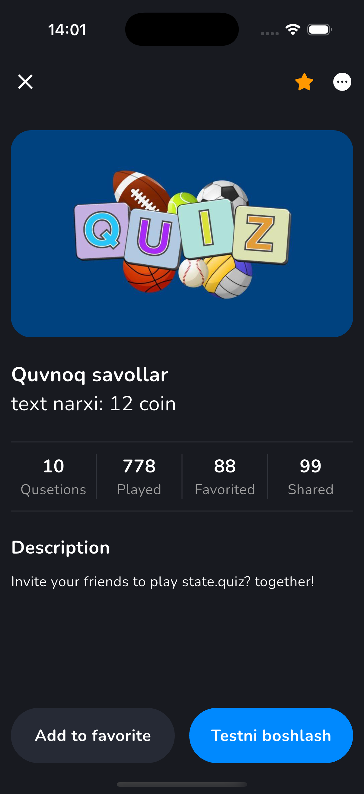

# 🧠 Piima Quiz

**Piima Quiz** is a modern and interactive mobile quiz application built using **Flutter** and powered by **Firebase Firestore** as the backend. It follows the **Clean Architecture** approach and uses **Bloc** for state management. The app supports **user authentication**, **quiz history tracking**, and **responsive UI** with `flutter_screenutil`. Local data caching is handled with **Hive**.

---

## ✨ Features

- 🔥 Cloud-based quiz system using Firebase Firestore
- 🔐 Secure login and registration via Firebase Authentication
- ✅ Clean Architecture (Data, Domain, and Presentation layers)
- 📦 State management using `flutter_bloc`
- 💾 Local data caching using Hive
- 📱 Fully responsive UI with `flutter_screenutil`
- 📝 Quiz questions, answers, and results tracking
- 📊 Test progress bar and correct/incorrect feedback
- 🧠 Displays quiz statistics like attempts, favorites, and shares
- 🎉 Interactive result screen with total score

---

## 🧪 Tech Stack & Dependencies

| Technology / Package       | Description                                  |
|----------------------------|----------------------------------------------|
| **Flutter**                | Cross-platform mobile development            |
| **Firebase Firestore**     | NoSQL cloud database for quizzes & results   |
| **Firebase Auth**          | Email/password-based user authentication     |
| **Hive**                   | Lightweight local storage (for caching)      |
| **flutter_bloc**           | State management using Bloc pattern          |
| **flutter_screenutil**     | Responsive UI design based on screen sizes   |

---

## 📸 Screenshots

### 🟢 Splash & Home Screens
| Splash Screen | Home Screen |
|---------------|-------------|
|  |  |

---

### 🧾 Quiz Details Screen

---

### 🧪 Test Screens

| Test Step 1 | Test Step 2 |
|-------------|-------------|
|  |  |

**Final Answer Review:**

---

### 🏁 Result & 🏆 Leaderboards Screens

| Result Screen | Leaderboards |
|---------------|--------------|
|  |  |

